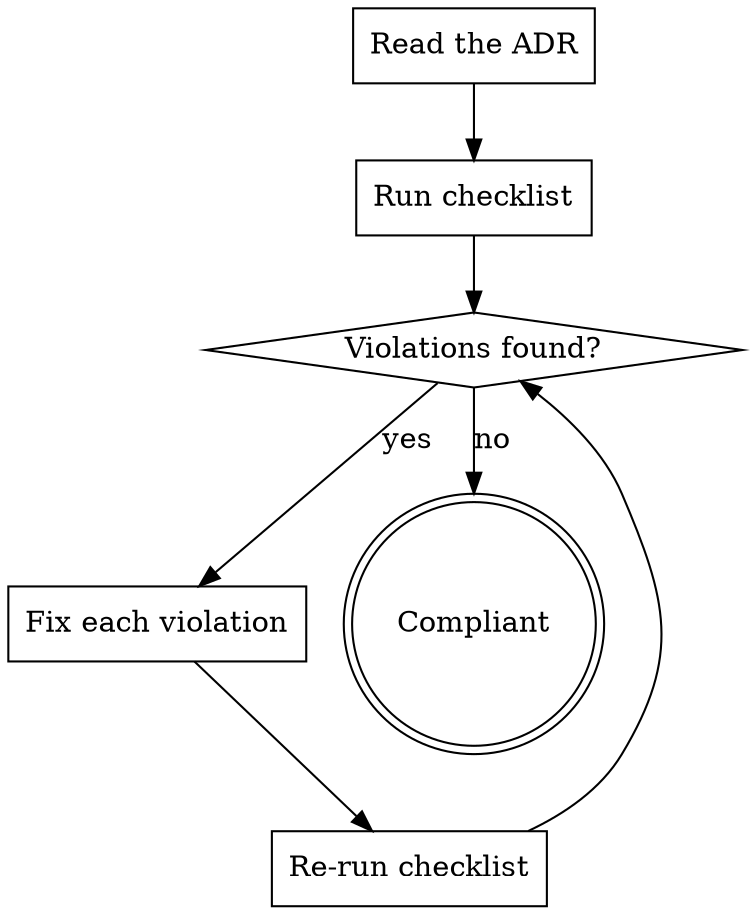

# MADR v4 Compliance

**Spec source:** https://adr.github.io/madr
**Version:** 4.0.0 (2024-09-17)

> **Note SINAPSE:** This skill describes the upstream MADR v4 spec (English). SINAPSE adapts it with French section names, categorized consequences, and Obsidian-specific formatting. When writing SINAPSE ADRs, use the `sinapse-adr-writing` skill as primary reference and this skill as background spec knowledge.

## SINAPSE ↔ MADR v4 Mapping

| MADR v4 (upstream) | SINAPSE adaptation |
|---------------------|-------------------|
| `## Context and Problem Statement` | `## Contexte et problème` |
| `## Decision Drivers` | `## Critères de décision` |
| `## Considered Options` | `## Options envisagées` |
| `## Decision Outcome` | `## Décision` |
| `### Consequences` | `### Conséquences` (categorized: Techniques, Organisationnelles, Métier, Économiques) |
| `### Confirmation` | `### Critères de vérification` |
| `## Pros and Cons of the Options` | `## Pours et contres des différentes options envisagées` |
| `## More Information` | `## Autres informations et références` |
| `Good, because` / `Bad, because` | `Bon, car` / `Mauvais, car` |
| `Neutral, because` | `Neutre, car` |
| `Chosen option: "X", because` | `> [!success] Option retenue : Option X : Desc` + `Je choisis X car` |
| `status: accepted` | `statut: Validé` |
| `decision-makers:` | `deciders:` |
| `* ` list marker | `- ` list marker |
| `NNNN-title-with-dashes.md` | `ADR-NNN — Titre du sujet.md` |

---

## Compliance Workflow



---

## 1. File Naming (ADR-0005)

**MADR v4 rule:** `NNNN-title-with-dashes.md`

**SINAPSE override:** `ADR-NNN — Titre du sujet.md` (French, em-dash separator, 3-digit number)

---

## 2. YAML Frontmatter (ADR-0013)

All fields are **optional** but must use these exact keys and values if present:

```yaml
---
status: proposed          # proposed | rejected | accepted | deprecated | superseded by ADR-{NNNN}
date: YYYY-MM-DD          # ISO 8601 date of last update
decision-makers: Alice, Bob  # comma-separated or YAML list
consulted: Charlie           # subject-matter experts (two-way communication)
informed: Team, Stakeholders # one-way notification recipients
---
```

**SINAPSE overrides:** `statut:` (French), `deciders:` (not `decision-makers:`), additional fields (`phase:`, `prerequisites:`, `related:`, `tags:`)

---

## 3. Required Sections (in order)

These four sections are **required and must appear in this order**:

```
# {Title}
## Context and Problem Statement
## Considered Options
## Decision Outcome
```

**Section heading rules (ADR-0002, ADR-0007):**
- No numbers in headings: `## Option 1` ✗ → `## PostgreSQL` ✓
- No bold/italic in headings: `## **Decision Outcome**` ✗ → `## Decision Outcome` ✓

---

## 4. Optional Sections (in order if used)

Must appear in this sequence relative to each other:

```
## Decision Drivers          ← before Considered Options
## Considered Options
## Decision Outcome
  ### Consequences           ← subsection of Decision Outcome
  ### Confirmation           ← subsection of Decision Outcome
## Pros and Cons of the Options  ← AFTER Decision Outcome (ADR-0016)
  ### {Option title}
## More Information
```

**ADR-0016:** Pros and Cons detail must come **after** Decision Outcome, not before.

---

## 5. Content Format Rules

### Title (H1)
```markdown
# Use PostgreSQL as the primary database
```
Short, describes both problem and solution. No "ADR-NNN" prefix in heading.

### Context and Problem Statement
```markdown
## Context and Problem Statement

The application needs persistent storage for user data and transactional operations.
The current in-memory solution does not survive restarts. We need to choose a database
that fits our team's skills and infrastructure constraints.
```
- 2-3 sentences OR a short narrative story
- May include links to issues/tickets
- End with the question being answered (optional)

### Considered Options (ADR-0011)
```markdown
## Considered Options

* PostgreSQL
* MySQL
* SQLite
```
- **Asterisk `*` only** as list marker (not `-` or `+`) — SINAPSE uses `-` instead
- Option title only (no description here — details go in Pros and Cons)
- Minimum 2 options

### Decision Outcome
```markdown
## Decision Outcome

Chosen option: "PostgreSQL", because it supports ACID transactions and has
strong community support matching our team's experience.
```
- **Exact format:** `Chosen option: "{title}", because {justification}`
- Title in double quotes
- Justification references the decision drivers or forces

### Consequences (subsection of Decision Outcome, ADR-0017)
```markdown
### Consequences

* Good, because ACID compliance ensures data integrity
* Good, because wide ecosystem of tools and extensions
* Bad, because requires dedicated DBA knowledge for production tuning
* Neutral, because licensing is open-source (no cost, no vendor SLA)
```
- **Must use:** `Good, because` / `Bad, because` / `Neutral, because` (ADR-0014, ADR-0017)
- **SINAPSE override:** categorized by domain (Techniques, Organisationnelles, Métier, Économiques) instead of flat Good/Bad/Neutral
- List marker: `*` only (SINAPSE uses `-`)
- One consequence per bullet

### Pros and Cons of the Options (ADR-0017)
```markdown
## Pros and Cons of the Options

### PostgreSQL

* Good, because supports ACID transactions
* Good, because well-known by the team
* Bad, because heavier than SQLite for simple use cases
* Neutral, because requires a separate server process

### SQLite

* Good, because zero configuration
* Bad, because no concurrent write support
```
- Subsection per option using the **exact option title** as H3
- Same `Good/Bad/Neutral, because` phrasing as Consequences
- Comes **after** `## Decision Outcome` (ADR-0016)
- **SINAPSE:** uses `Bon, car` / `Mauvais, car` / `Neutre, car`

### Confirmation (optional, ADR-0018)
```markdown
### Confirmation

Implementation compliance can be checked via:
* Code review verifying database driver usage
* Integration tests confirming transaction rollback behavior
```
- Subsection of Decision Outcome (`###`)
- Describes HOW compliance will be validated (tests, reviews, etc.)
- **SINAPSE:** named `### Critères de vérification`

---

## 6. Full Compliance Checklist

Run these checks on the ADR being reviewed:

### File
- [ ] Filename follows convention (MADR: `NNNN-title.md` / SINAPSE: `ADR-NNN — Titre.md`)

### Frontmatter
- [ ] Status value is valid
- [ ] Date in `YYYY-MM-DD` format
- [ ] Decision-makers field present

### Structure & Order
- [ ] H1 title present
- [ ] Context/Problem section present
- [ ] Options section present
- [ ] Decision section present
- [ ] Section order: Context → (Drivers) → Options → Decision → (Pros and Cons) → (References)
- [ ] No numbers in heading text
- [ ] No bold/italic formatting in headings

### Content
- [ ] Context: 2-3 sentences or short narrative
- [ ] Options: ≥ 2 options listed
- [ ] Decision clearly states chosen option with justification
- [ ] Consequences (if present): categorized or using Good/Bad/Neutral format
- [ ] Pros and Cons (if present): same structured format
- [ ] Pros and Cons subsection titles match Options titles exactly

---

## 7. Common Violations & Fixes

| Violation | Fix |
|-----------|-----|
| `Positive:` / `Negative:` consequences | Use `Good, because` / `Bad, because` (or SINAPSE: `Bon, car` / `Mauvais, car`) |
| `## Pros and Cons` before `## Decision Outcome` | Move Pros/Cons section after Outcome |
| `## Option 1:` in Pros and Cons | Use option title: `### PostgreSQL` |
| `**Decision Outcome**` (bold heading) | Remove bold: `Decision Outcome` |
| Consequences not under Decision | Nest correctly under Decision section |
| Decision Drivers after Options | Move Decision Drivers before Options |
| Flat Positif/Négatif consequences (SINAPSE) | Categorize: Techniques, Organisationnelles, Métier, Économiques |

---

## 8. Minimal Valid ADR Example

```markdown
---
status: accepted
date: 2024-09-17
decision-makers: Alice, Bob
---

# Use PostgreSQL as the primary database

## Context and Problem Statement

The application needs persistent storage for user data and transactional operations.
We need to choose a database that fits our team's skills and infrastructure constraints.

## Considered Options

* PostgreSQL
* SQLite

## Decision Outcome

Chosen option: "PostgreSQL", because it supports ACID transactions and matches
the team's existing expertise.

### Consequences

* Good, because ACID compliance ensures data integrity
* Bad, because requires a running server process
```
